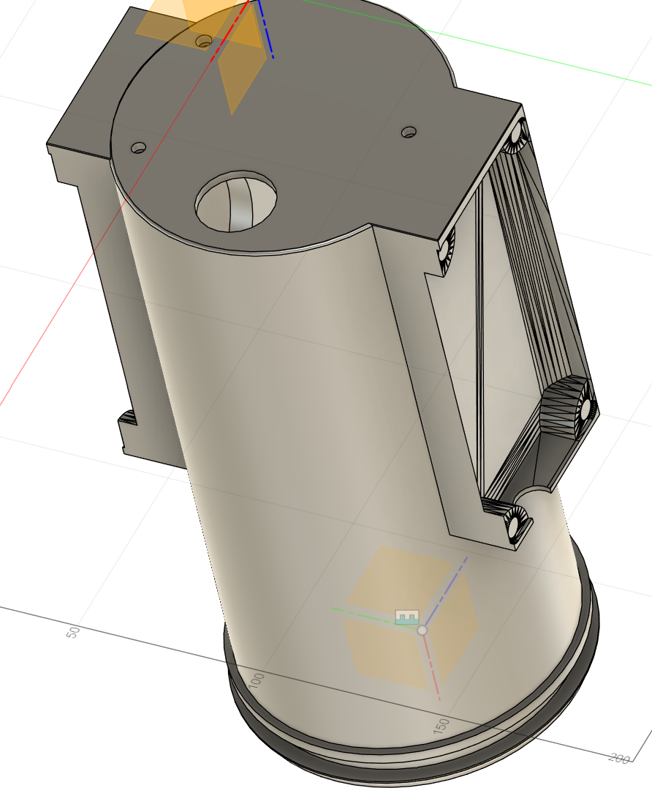
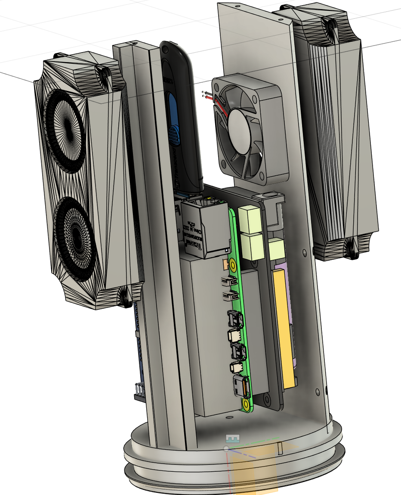
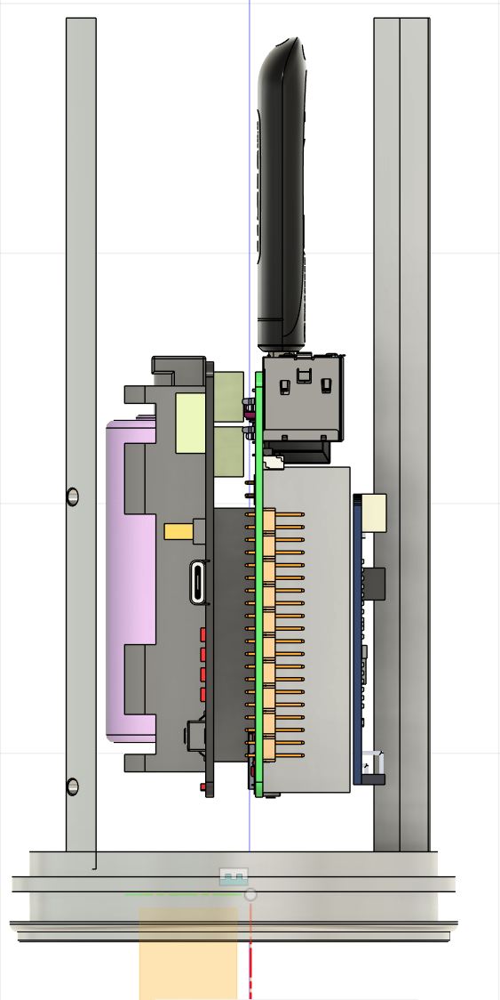
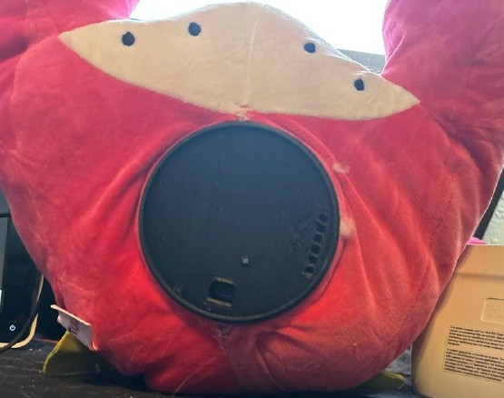
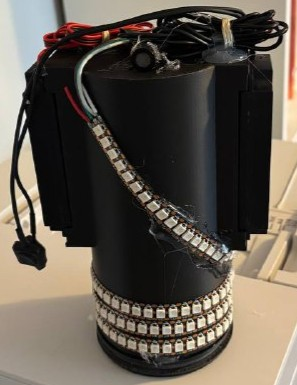

# DinoToy Internal Enclosure 3D Models

This repository contains the 3D model assets for the internal enclosure of the DinoToy project.  
The enclosure is designed to house and support all of the electronics and components needed to bring DinoToy to life.

---

## Supported Components

- Raspberry Pi 5 (RPI5)  
- Geekworm X1200 UPS Hat (with two battery cells)  
- USB drive  
- WM8960 audio board  
- Two Raspberry Pi external speakers (for WM8960)  
- Space for USB-to-condenser-mic adapter  
- 40×40×10 mm case fan  
- Bottom-mount USB-C port (for charging)

---

## Preview Images & Video

### Prototype in Action

### Outside Shell with Speaker Slots

### Tilted Side Perspective (shows fan cutout & component layout)

### Straight Side View of Internal Cavity

### Prototype in Plushie Bottom Half

### Assembled Prototype Exterior

## 3D Model Files

- **Models/Full_Exports/Case.f3z**  
  Full Fusion 360 archive including all component-placement sketches.

- **Models/Button.step**  
  3D model of the power button.

- **Models/Case_Shell.step**  
  External case shell geometry.

- **Models/Case_Bottom_Inside.step**  
  Internal shell & bottom-plate geometry.

---

## Usage

1. Clone or download this repository.  
2. Open the `.step` or `.f3z` files in your preferred CAD software (Fusion 360, FreeCAD, SolidWorks, etc.).  
3. Review or modify the enclosure, then export for 3D printing or CNC machining.

---

## License

This project is licensed under the AGPL License. See [LICENSE](LICENSE) for details.
